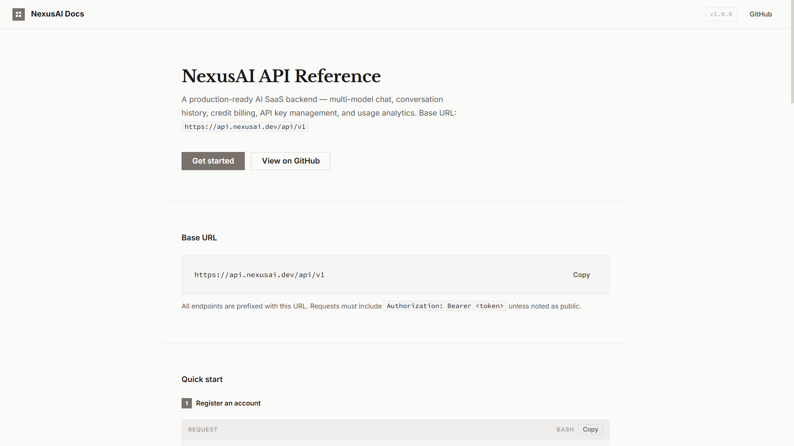

# NexusAI AI SaaS Backend API

[](https://www.typescriptlang.org/)
[](https://nodejs.org/)
[](https://expressjs.com/)
[](https://www.mongodb.com/)
[](https://redis.io/)
[](tests/)
[](tests/)
[](LICENSE)

NexusAI is a **production-ready AI SaaS backend platform** that provides multi-model AI chat, conversation history, credit-based billing, subscription plans, API key management, and usage analytics all through a secure, scalable Node.js/Express REST API.

---

## 📖 API Documentation

A full static API reference website is included in the `docs/` directory. Open `docs/index.html` directly in your browser no build step required.



The documentation covers all 9 API modules with endpoint references, request/response examples, parameter tables, and live copy-to-clipboard code blocks.

> **Modules covered:** Authentication · User · AI Chat · Conversation · Credits · API Keys · Subscriptions · Analytics · Admin

---

## 🚀 Key Features

- **JWT + Refresh Token Auth** Dual-token rotation, device-limit enforcement, and Redis-backed brute-force lockout
- **Role-Based Access Control (RBAC)** `user` and `admin` roles with API key scope middleware
- **Multi-Model AI Chat** Gemini 1.5 Pro/Flash active; OpenAI/Anthropic ready to plug in via provider router
- **Server-Sent Events (SSE)** Real-time token streaming with graceful fallback
- **Credit & Ledger System** Atomic MongoDB transactions; credits can never go below zero
- **Subscription Lifecycle** Free → Starter → Pro → Enterprise with BullMQ renewal jobs
- **API Key Management** SHA-256 hashed keys, prefix-only display, per-key scopes, IP whitelisting, and key rotation
- **Usage Analytics** Per-user and platform-wide metrics with Redis caching (5–10 min TTL)
- **Background Jobs (BullMQ)** Transactional email, subscription renewal, API key usage logging, and cleanup queues
- **Security Layer** Helmet headers, CORS, compression, Redis sliding-window rate limiting

---

## 👥 Target Users

| Audience | What they get |
| :--- | :--- |
| **Developers** | API key management, multi-model AI integration, usage analytics |
| **Startups** | Credit billing + subscription architecture out of the box |
| **Businesses** | RBAC, team-level usage control, audit trails via credit ledger |
| **Content Creators** | Conversation history, custom system prompts, multi-model access |

---

## 🛠️ Tech Stack

| Layer | Technology |
| :--- | :--- |
| Language & Runtime | TypeScript (strict mode) · Node.js v20+ |
| Framework | Express.js |
| Database | MongoDB Atlas (Mongoose ODM) |
| Cache & Queue | Redis (ioredis) · BullMQ |
| Validation | Zod |
| API Docs | Swagger UI (`swagger-jsdoc` + `swagger-ui-express`) |
| Static Docs Site | Vanilla HTML/CSS/JS zero build pipeline |
| Testing | Jest · Supertest |
| Containerization | Docker · Docker Compose |
| CI/CD | GitHub Actions |
| Package Manager | pnpm |

---

## 📂 Project Structure

Feature-based (Domain-Driven) architecture:

```
nexusai-api/
├── src/
│   ├── config/           # Environment config, DB connection, Redis, BullMQ
│   ├── modules/          # Feature modules (one folder per domain)
│   │   ├── auth/         # JWT, refresh token, email verification
│   │   ├── user/         # User profile, role management
│   │   ├── ai/           # AI chat, multi-model routing
│   │   ├── conversation/ # Conversation history CRUD
│   │   ├── credit/       # Credit ledger, deduction, top-up
│   │   ├── apikey/       # API key generation and management
│   │   ├── subscription/ # Plans, user subscriptions
│   │   ├── analytics/    # Usage stats, aggregation queries
│   │   └── admin/        # Admin-only endpoints
│   ├── shared/
│   │   ├── middleware/   # Auth, RBAC, rate limit, error handler
│   │   ├── utils/        # Helpers: hash, token, pagination, response
│   │   ├── types/        # Shared TypeScript types and interfaces
│   │   └── errors/       # Custom error classes (AppError, etc.)
│   ├── jobs/             # BullMQ job processors (email, analytics)
│   ├── docs/             # Swagger definitions
│   └── app.ts            # Express app setup
├── docs/                 # Static API reference website (open index.html)
├── tests/
│   ├── unit/
│   └── integration/
├── docker/
│   ├── Dockerfile
│   └── docker-compose.yml
├── .github/workflows/ci.yml
├── .env.example
└── package.json
```

---

## ⚙️ Getting Started

### Prerequisites

- [Node.js](https://nodejs.org/) v20+
- [pnpm](https://pnpm.io/) package manager
- [Docker](https://www.docker.com/) (for local Redis)
- MongoDB Atlas account (or local MongoDB)

### 1 Clone & Install

```bash
git clone <repository-url>
cd nexusai
pnpm install
```

### 2 Start Redis

```bash
docker run -d \
  --name nexusai-redis \
  -p 6379:6379 \
  -v nexusai_redis_data:/data \
  redis:7-alpine redis-server --appendonly yes
```

### 3 Configure Environment

```bash
cp .env.example .env
```

Key variables to fill in:

| Variable | Description |
| :--- | :--- |
| `MONGODB_URI` | MongoDB Atlas connection string |
| `REDIS_URL` | `redis://localhost:6379` |
| `JWT_ACCESS_SECRET` | Random 64-char string |
| `JWT_REFRESH_SECRET` | Random 64-char string |
| `GOOGLE_AI_API_KEY` | Google AI (Gemini) API key |
| `RESEND_API_KEY` | Resend / SMTP credentials |

### 4 Seed & Run

```bash
pnpm db:seed   # Seeds plans and admin user
pnpm dev       # Start dev server at http://localhost:3000
```

---

## 🛠️ Commands

```bash
# Development
pnpm dev              # Dev server with ts-node-dev (auto-reload)
pnpm build            # Compile TypeScript → dist/
pnpm start            # Run compiled production build

# Code Quality
pnpm lint             # ESLint check
pnpm format           # Prettier format
pnpm typecheck        # tsc --noEmit

# Testing
pnpm test             # All tests
pnpm test:unit        # Unit tests only
pnpm test:integration # Integration tests only
pnpm test:coverage    # Coverage report

# Database
pnpm db:seed          # Seed plans + admin user
pnpm db:reset         # Drop all collections and re-seed

# Docker
docker compose up -d            # Start all services
docker compose down             # Stop all services
docker compose logs -f api      # Stream API logs
```

---

## 🧪 Testing & Coverage

118 tests across 16 suites all passing.

| Module | Statement | Function | Status |
| :--- | :---: | :---: | :---: |
| **Overall** | **70.61%** | **58.93%** | ✅ |
| `admin.service.ts` | 98.42% | 100.00% | ✅ |
| `ai.service.ts` | 98.88% | 87.50% | ✅ |
| `analytics.service.ts` | 98.14% | 100.00% | ✅ |
| `apiKey.service.ts` | 92.00% | 100.00% | ✅ |
| `auth.service.ts` | 99.40% | 100.00% | ✅ |
| `conversation.service.ts` | 93.22% | 100.00% | ✅ |
| `credit.service.ts` | 100.00% | 100.00% | ✅ |
| `subscription.service.ts` | 90.56% | 100.00% | ✅ |

**Test isolation:** Each Jest worker gets a unique MongoDB database (`nexusai_test_<id>`) and Redis database index (`JEST_WORKER_ID % 16`). BullMQ processors are disabled during tests.

```bash
pnpm test:coverage
```

---

## 📡 Swagger UI

Interactive API explorer available when the server is running:

```
http://localhost:3000/api/v1/docs
```

> Set `SWAGGER_ENABLED=true` in production to expose the Swagger UI.

---

## 👤 Credits & Contact

<div align="left">
  <a href="https://www.instagram.com/shoyou.nt/" target="_blank">
    
  </a>
  <a href="https://discord.com/" target="_blank">
    
  </a>
  <a href="mailto:dendradetama2@gmail.com" target="_blank">
    
  </a>
  <a href="https://www.linkedin.com/in/dendra-de-tama/" target="_blank">
    
  </a>
</div>

<br/>

<div align="center">
  <i>"Code is art. Make it beautiful."</i> De4nity
</div>
